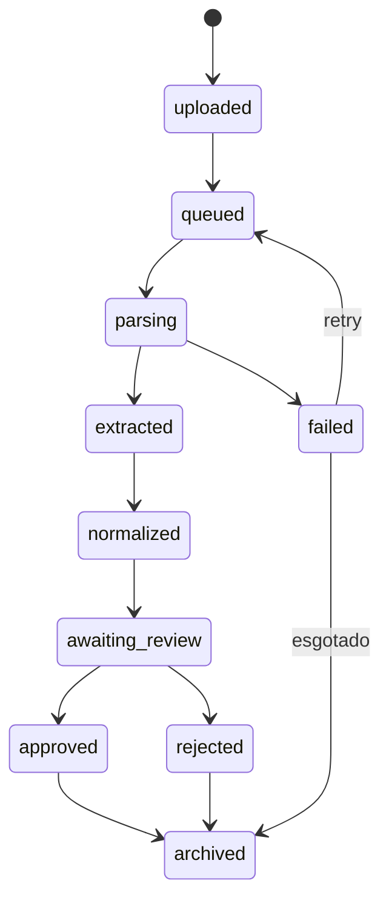

# Exports — Diagrams

Diagramas de arquitetura e modelo de dados exportados.

## Tipos de Diagrama

- ERD (Entity Relationship Diagram) — modelo de banco
- Fluxo de workflows — estado de documentos e importações
- Arquitetura do sistema — componentes e integrações
- Lifecycle do ImportSession

## Ferramentas

- ERD: dbdiagram.io ou DBeaver
- Fluxos: Mermaid (renderizável no GitHub)
- Arquitetura: Excalidraw ou draw.io

## Diagramas Planejados

